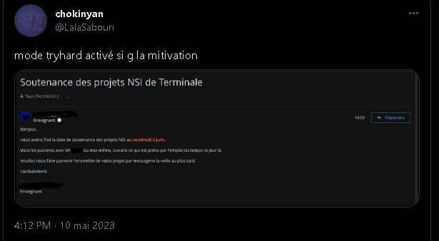

# nsi-projet

mon projet d'nsi terminal

Faites pas attention au nom des commits vue que je travailes seul et que c'est un truc qui est juste a rendre vers fin mars je ne cherche pas à être sérieux ou me souler.

je tiens a remercier le mec qui taffe avec moi pour m'avoir données les manifiques fichiers qui sont :

    - code.PY

    - Tentative_2.py

    - Tzntative_1.py

